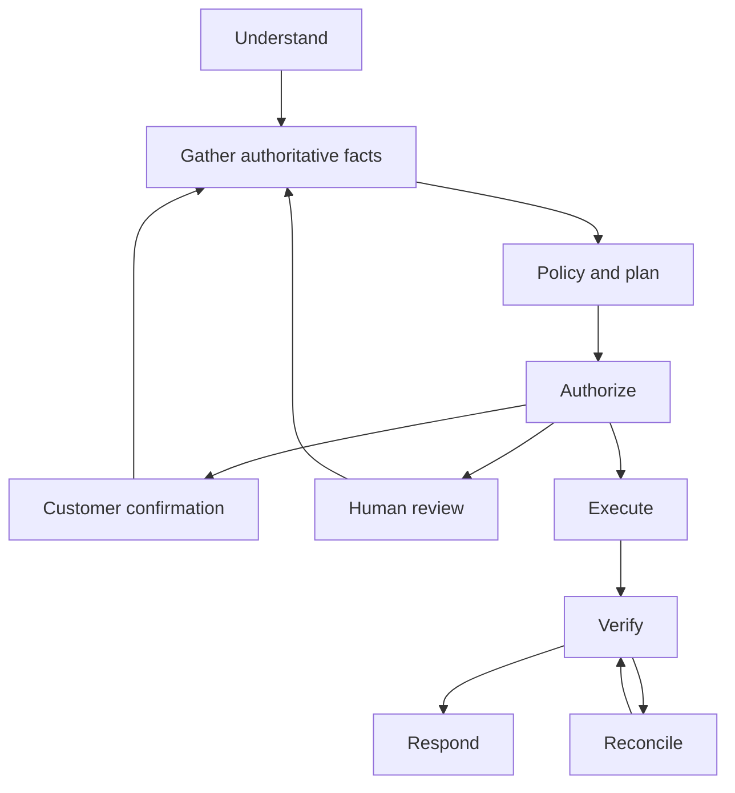

# Architecture

## Control boundary

The planner selects only a supported intent and confidence. Authenticated identity, ownership, authoritative facts, eligibility, amounts, risk, approval and execution belong to server code. Customer messages and retrieved prose never confer authority. Unknown/multiple requests ask for clarification. This is an explicit workflow, not a free-running agent loop.

Allowed state transitions are enforced in `backend/agent/service.py`. Human/customer approvals store actor, role and canonical plan hash. Resume repeats gathering, eligibility and risk computation. Operator approval cannot override denial. Reducing a refund or credit creates a new hash and is rechecked. Read-only status cases never create business action rows.

## State and persistence

Sixteen tables including audit and approval records store customers, accounts, subscriptions, payments, orders/items/shipments, refunds, credits, fraud flags, exceptions, cases, actions and provider events. The initial Alembic migration is an explicit schema snapshot. Monetary values are integer USD cents. PostgreSQL is the Docker/CI database; SQLite serializes local transactions for convenient offline work.

Conversation state is the customer's message and model classification. Authoritative state is a fresh business-data snapshot. Operational knowledge is versioned policy documentation and experiment reports; it is not silently learned from arbitrary customer text. No cross-customer conversation memory is used.

## Transactions and idempotency

API case creation commits before any external call, preserving a stable case ID. A unique `(customer_id, request_key)` protects submission replay and the request hash rejects changed payloads. Action keys bind case ID to a canonical plan. Customer-row locks serialize simultaneous mutations and protect aggregate balance across distinct cases. Refunds have unique action/provider references and payments enforce balance constraints.

A provider timeout enters `RECONCILE`. The stable provider key retries the original refund; it never creates a new logical request. Other mutations for a customer are blocked while an earlier action remains pending. Retries of an unknown external refund stop after 23 hours, before Stripe's typical idempotency retention boundary; they require manual investigation. This cutoff is conservative, not an assertion that provider deduplication lasts forever.

Successful local effects and ledger changes commit atomically. Provider acceptance is distinct from verification. Pending/failed refunds do not produce a success response. Refund balance is reserved when a provider reference is received; unknown outcomes block subsequent mutation. Failed refund events release reserved balance exactly once.

External network calls currently occur while holding the customer transaction lock. This simplifies correctness at low throughput but is a scalability bottleneck. A production version should use a durable outbox/claim protocol with explicit balance reservations and provider reconciliation rather than extending this transaction pattern indefinitely.

## Events and worker

Stripe signature validation precedes durable storage. Event IDs deduplicate delivery. Older applied-object events are ignored; terminal refund state cannot regress. Unknown references remain `unmatched` for replay. Updates and event status commit together. The worker polls durable SQL reconciliation work; Redis can wake it early, but losing Redis state cannot lose a case. Redis is not the source of truth or an exactly-once queue.

## UI and access

React console displays evidence, amount, required authority, short decision summaries, and tool records—not hidden model reasoning. All API calls require configured customer/operator bearer credentials. The demo models one configured customer and one operator. There is no production SSO, multi-tenant membership service or token rotation UI. Customer role selectors are cosmetic; backend token identity is authoritative. API mutation routes reuse the same workflow rather than exposing raw financial tools.

## Current limitations

Full-balance refunds are the supported free-text refund workflow; no partial-refund intent extraction, multi-currency conversion, real fulfillment provider, semantic offline embedding model, calibrated risk model, or production IAM. The five-document retrieval corpus and generated scenario families are engineering regression tests, not evidence of broad-language generalization. Faults are deterministic injected exceptions/markers, not a full network partition or database crash campaign. See the technical report for deployment gates.
